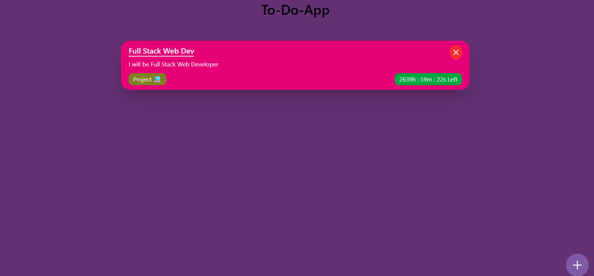

# 📝 React To-Do App

A simple and responsive **To-Do application built with React** that helps users create, organize, and manage their daily tasks.

This project was built to practice React fundamentals such as **components, state management, forms, props, routing, and user interactions**.

## 🚀 Features

* ➕ Add new tasks
* 📝 Add task title and details
* 🏷️ Organize tasks using categories
* 📅 Set date and time for tasks
* 📋 View and manage tasks
* 📱 Responsive user interface
* ⚡ Fast and smooth experience with React and Vite

## 🛠️ Built With

* React
* JavaScript
* HTML
* CSS
* Vite
* React Router

## 📸 Screenshot

## 🌐 Live Demo

[**Try the app:** https://to-do-app2-neon.vercel.app/](https://to-do-app2-neon.vercel.app/)

## 📚 What I Learned

While building this project, I practiced:

* Managing data using React `useState`
* Creating reusable React components
* Handling form inputs
* Passing data using props
* Working with React Router
* Managing user interactions
* Structuring a React application

## 🔮 Future Improvements

* Save tasks using Local Storage
* Add task editing
* Add task deletion
* Add task completion status
* Add task filtering and searching
* Add a backend and database

## 👨‍💻 Author

**Hemant Kohli**

Built as part of my React learning journey.
